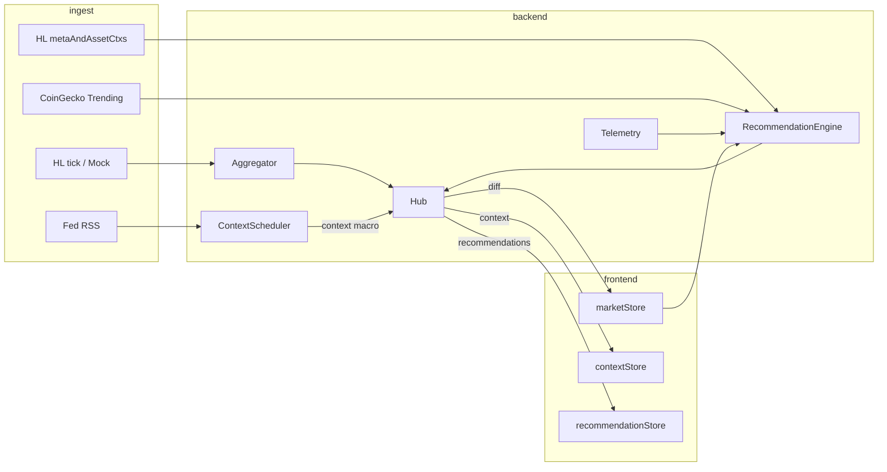

# Context Feed 架构（零 Key · 宏观稿 + 热搜推荐）

> **接口明细与实测记录**：[`context-feed-data-sources.md`](./context-feed-data-sources.md)  
> 对应 [`axis.md`](./axis.md) §擴展目標

## 1. 方案范围

Stretch 采用 **无需 API Key** 即可跑通的数据源，分两条线：

| 线 | 用途 | 数据源 | Key | 实测 |
|----|------|--------|-----|------|
| **情境 / 宏观** | 联储与宏观新闻稿 | **Federal Reserve RSS** | ❌ | ✅ 200 |
| **热搜 / 推荐** | 「你可能还想看」 | **CoinGecko Trending** + **Hyperliquid Info** + **本地 telemetry** | ❌ | ✅ |

不纳入本方案主路径（需 Key 或未测通）：CryptoPanic、Finnhub、FRED、Alternative.me Fear & Greed。

### 与 axis 扩展目标的对应

| axis 目标 | 本方案落地 |
|-----------|------------|
| 相关市场动态（联储等） | Fed RSS `press_monetary.xml` + `press_all.xml` → Context 资讯条 |
| 根据浏览器活动推荐市场 | telemetry 行为分 + HL 24h 量/费率 + CoinGecko 热搜加权 → `recommendations` |

---

## 2. 数据源接口（本方案使用）

### 2.1 宏观 / 联储稿 — Fed RSS

| 源 | URL | 轮询 |
|----|-----|------|
| 货币政策 / FOMC | `https://www.federalreserve.gov/feeds/press_monetary.xml` | 15–30min |
| 全部新闻稿 | `https://www.federalreserve.gov/feeds/press_all.xml` | 15–30min |

后端 `fetch` + XML 解析，映射：

```ts
{
  kind: 'macro',
  title: item.title,
  url: item.link,
  summary: item.description?.slice(0, 200),
  symbols: ['BTC', 'ETH'],   // 宏观默认关联主流 perp
  tags: ['fed', 'fomc'],
  ts: new Date(item.pubDate).getTime(),
  source: 'fed_rss',
}
```

### 2.2 热搜 — CoinGecko Trending

```http
GET https://api.coingecko.com/api/v3/search/trending
Accept: application/json
```

| 项 | 说明 |
|----|------|
| 轮询 | **≥5min**（免费档约 30 次/分钟，勿 30s 轮询） |
| 用法 | 取 `coins[].item.symbol`（如 `BTC`, `SOL`），与 HL universe 求交集后参与推荐分 |

```ts
// trending 本身不推 context，只喂 recommendationStore
trendingSymbols: string[]  // 与 HL meta.universe 过滤后的 symbol 列表
```

### 2.3 推荐特征 — Hyperliquid Info

```http
POST https://api.hyperliquid.xyz/info
Content-Type: application/json

{"type":"metaAndAssetCtxs"}
```

| 字段 | 推荐用途 |
|------|----------|
| `dayNtlVlm` | 24h 成交额 → 热度排序 |
| `funding` | 极端费率 → `reason: "High funding"` |
| `openInterest` | OI 靠前 → 补充 reason |

与现有 `feed/hyperliquid.ts` 的 tick 分离：**Context 调度器** 单独 60s 拉一次 Info，或复用 feed 切换时的 bootstrap 快照。

### 2.4 行为 — 本地 Telemetry（无外部 API）

| 事件 |  payload | 存储 |
|------|----------|------|
| `symbol_view` | `{ symbol, dwellMs }` | 内存 Map 或 session |
| `symbol_click` | `{ symbol }` | +1 click |
| `search` | `{ query }` | 匹配 HL symbol |

前端 `AssetDetail` / `Watchlist` 埋点 → `POST /telemetry`（或 WS `{ type: 'telemetry', ... }`）。

---

## 3. 架构



**原则**

- 行情 `diff` 与 Context / Recommendations **分消息类型**，不进入 `frameScheduler` 批处理。
- 全部第三方请求 **仅后端**；Fed RSS / CoinGecko / HL Info 均 **零 Key**。
- Context 仅 `macro`（Fed）；热搜只影响 `recommendations`，不冒充新闻流。

---

## 4. 协议扩展

```ts
type ContextItem = {
  id: string;
  kind: 'macro';              // 本方案仅宏观稿
  title: string;
  summary?: string;
  url?: string;
  symbols?: string[];
  tags?: string[];
  ts: number;
  source: 'fed_rss';
};

// Server → Client
| { type: 'context'; items: ContextItem[] }
| {
    type: 'recommendations';
    symbols: string[];
    reasons?: Record<string, string>;  // e.g. "Trending · High volume"
  }

// Client → Server（可选）
| { type: 'telemetry'; event: 'symbol_view' | 'symbol_click' | 'search'; symbol?: string; dwellMs?: number; query?: string }
```

---

## 5. 推荐引擎

```ts
function score(symbol: string): number {
  const t = telemetry.get(symbol);
  const hl = hlCtx.get(symbol);       // dayNtlVlm, funding, oi
  const trending = trendingSet.has(symbol);

  return (
    (t?.dwellMs ?? 0) / 1000 * 1 +
    (t?.clicks ?? 0) * 3 +
    (inPortfolio(symbol) ? 5 : 0) +
    (inWatchlist(symbol) ? 2 : 0) +
    normVolume(hl?.dayNtlVlm) * 2 +
    (trending ? 3 : 0) +
    (Math.abs(hl?.funding ?? 0) > FUNDING_THRESHOLD ? 1 : 0)
  );
}
```

- 取 Top **5**，排除已在 watchlist 的 symbol（或降权）。
- `reasons[symbol]` 取最高分因子文案，例如：
  - `"On CoinGecko trending"`
  - `"You viewed ETH often"`
  - `"High 24h volume on HL"`

**调度**

| 任务 | 间隔 |
|------|------|
| Fed RSS | 15–30min |
| CoinGecko trending | 5min |
| HL metaAndAssetCtxs | 60s |
| recommendations 推送 | trending/HL/telemetry 更新后，或每 30s 合并推一次 |

---

## 6. 后端模块

```
backend/src/context/
  fedRss.ts              # 解析 press_monetary + press_all，去重 merge
  coingeckoTrending.ts   # GET trending，filter by HL universe
  hyperliquidMeta.ts     # POST metaAndAssetCtxs → volume/funding map
  recommendation.ts      # score + TopN + reasons
  scheduler.ts           # 上表轮询 interval
  normalize.ts           # → ContextItem / recommendations payload

backend/src/telemetry.ts # 内存聚合；多实例 demo 可省略持久化
```

`hub.ts` 新增：

- `broadcastContext(items: ContextItem[])`
- `broadcastRecommendations(symbols, reasons?)`

`protocol.ts` / `frontend/lib/protocol.ts` 同步类型。

---

## 7. 前端落点

| 位置 | 展示 |
|------|------|
| `MarketOverview` 侧栏 | **Macro Feed**：Fed RSS 最新 5 条（标题 + 外链） |
| Watchlist 上方 | **Recommended**：`recommendations` 横条 + reason tooltip |
| `AssetDetail` | 可选：宏观条缩略 1 条 + 当前 symbol 是否在 trending |

埋点：

- 进入 / 离开 `AssetDetail` → `symbol_view` + `dwellMs`
- 点击 Watchlist 行 → `symbol_click`
- 搜索框提交 → `search`

---

## 8. 实现顺序

1. **`fedRss.ts`** + `broadcastContext` + 侧栏 Macro Feed（可独立演示「联储动态」）  
2. **`telemetry`** + **`hyperliquidMeta.ts`** + `broadcastRecommendations`（纯 HL + 行为）  
3. **`coingeckoTrending.ts`** 接入推荐 reason（「Trending」）  
4. 联调轮询间隔与去重（Fed `guid` / link 作 `id`）

---

## 9. 环境变量

```bash
# backend/.env.example — 本方案无需第三方 Key
CONTEXT_FED_RSS_MS=900000      # 15min
CONTEXT_TRENDING_MS=300000     # 5min
CONTEXT_HL_META_MS=60000         # 1min
RECOMMENDATIONS_PUSH_MS=30000
FUNDING_ALERT_THRESHOLD=0.0001   # 费率绝对值阈值，按 HL 返回单位调整
```

---

## 10. 风险与边界

| 项 | 说明 |
|----|------|
| Fed RSS | 仅英文官方稿；**无按 coin 新闻**，`symbols` 用规则默认 `BTC,ETH` |
| CoinGecko | symbol 与 HL 命名可能不一致（需 uppercase + universe 过滤） |
| HL Info | 与 mock feed 切换时清空 recommendation 缓存，避免 stale symbol |
| 多 tab | telemetry 按 session 即可，demo 不要求登录态 |

更完整的备选 API（含需 Key 源）见 **[context-feed-data-sources.md](./context-feed-data-sources.md)**；**本设计文档以零 Key 路径为准**。
