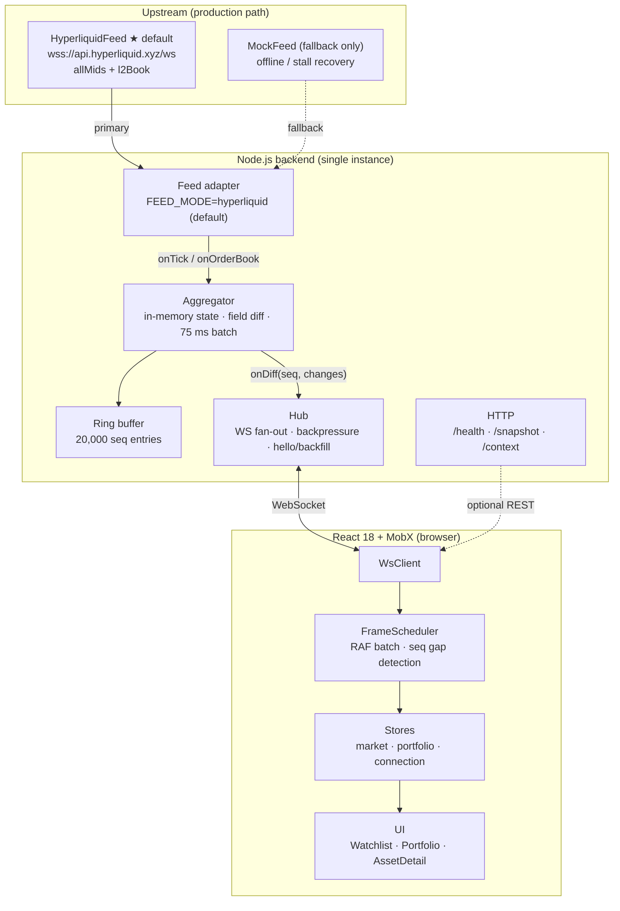
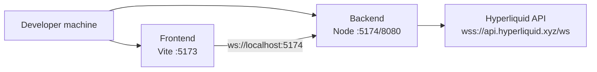
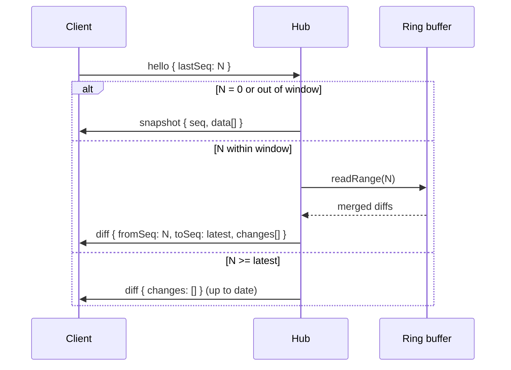
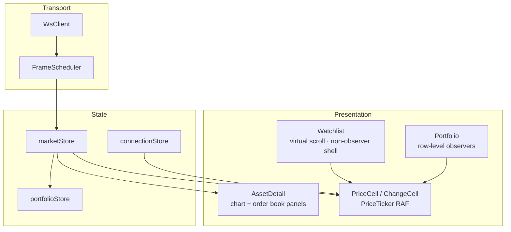

# Technical Design — axis-trading

> Real-time watchlist and mock portfolio over a self-built WebSocket backend.  
> Market focus: **Hyperliquid perpetuals** (live `allMids` + `l2Book` depth).  
> **Default feed**: `HyperliquidFeed` — mock is optional fallback only.  
> Document version: 2026-05-31

---

## 1. Executive Summary

**axis-trading** is a single-page web application that streams tick-by-tick market updates over WebSockets. The browser never connects to an exchange directly; all quotes flow through a Node.js backend that ingests **Hyperliquid live data** (`wss://api.hyperliquid.xyz/ws`), computes field-level diffs, batches updates, and fans them out to many clients from one in-process hub.

The frontend renders hundreds of live Hyperliquid symbols and a **mock portfolio** (static positions, live P&L) with smooth number animations at ~60 fps, visible connection state, reconnect with sequence backfill, and correct reconciliation after a 30-second background tab.

**Delivery**: public GitHub repo, one-command local deploy (`pnpm start`), and a 3–5 minute walkthrough video.

---

## 2. Goals & Scope

### 2.1 Product goals

| Screen | Requirements |
|--------|----------------|
| **Watchlist** | Symbol, last price, 24h change %; search/sort; virtual scroll for all streamed symbols |
| **Portfolio** | Mock positions: qty, avg cost, last, unrealized P&L, total value; updates every tick |
| **Asset detail** | Day open/high/low/volume, live price chart, order book depth |
| **Connection UX** | Visible states: connected, reconnecting, stale, disconnected |
| **Background resume** | Tab hidden ≥30s → return without full reload or zombie prices |

### 2.2 Backend goals

| Requirement | Implementation |
|-------------|----------------|
| Ingest quote feed | **`HyperliquidFeed` (default)**: `allMids` mark prices + per-symbol `l2Book` depth |
| Fallback feed | `MockFeed` via `FEED_MODE=mock` or Settings toggle; used when HL stalls or for offline dev |
| Fan-out without per-client upstream work | Single aggregator + in-process `Hub` |
| Diff-only wire format | `MarketDiff` = `{ symbol }` + changed fields only |
| Batch window | 75 ms flush (within assignment’s 50–100 ms range) |
| Reconnect backfill | Client `hello { lastSeq }` → ring buffer replay or snapshot |

### 2.3 Non-goals (48-hour scope)

- Authentication / multi-user isolation
- Persistent storage (Redis/DB)
- Production-grade horizontal scaling
- Mobile native app (web-only)

---

## 3. System Architecture

### 3.1 High-level diagram



### 3.2 End-to-end data path

```
Hyperliquid allMids / l2Book tick
  → Aggregator.onTick / onOrderBook (merge into Map<symbol, MarketItem>)
  → pendingBatch (last-write-wins per symbol)
  → flush every 75 ms → seq++ → RingBuffer.push
  → Hub.fanOut(diff) to all clients (skip slow sockets)
  → Browser WsClient.onmessage
  → FrameScheduler.enqueue → RAF flush → marketStore.applyDiffBatch (single runInAction)
  → Row-level MobX observers (PriceCell, ChangeCell, PortfolioRow)
  → RAF / Canvas updates (DOM ref or canvas draw, no list-wide React re-render)
```

### 3.3 Deployment topology



**Local one-command start**: `pnpm install && pnpm start` (concurrently runs backend + frontend on ports 5174 and 5173).

---

## 4. Backend Design

### 4.1 Module responsibilities

| Module | File | Responsibility |
|--------|------|----------------|
| **Server** | `server.ts` | HTTP + WebSocket server, feed lifecycle, client message routing |
| **Aggregator** | `aggregator.ts` | Authoritative in-memory `Map<symbol, MarketItem>`; field-level diff vs `lastSent`; timed flush |
| **Ring buffer** | `ringBuffer.ts` | Fixed 20k-entry store of `{ seq, changes[] }` for reconnect replay |
| **Hub** | `hub.ts` | Client registry; `resolveHello()` backfill; fan-out with backpressure |
| **Hyperliquid feed** | `feed/hyperliquid.ts` | **Default.** `allMids` mark prices + per-symbol `l2Book` depth; reconnect with exponential backoff |
| **Mock feed** | `feed/mock.ts` | **Fallback only.** Deterministic 200-symbol generator for offline dev or HL stall recovery |

### 4.2 Aggregator & diff engine

On each upstream tick the aggregator:

1. Updates `state` (price, day high/low, change %, timestamp).
2. Compares against `lastSent` and emits only changed fields into `pendingBatch`.
3. On flush (75 ms interval): merges batch, increments `seq`, writes to ring buffer, invokes `onDiff`.

**Order book**: `onOrderBook(symbol, bids, asks)` patches depth fields into the same diff pipeline so clients receive `bids`/`asks` only when they change.

### 4.3 WebSocket protocol (summary)

**Client → server**

| Message | Purpose |
|---------|---------|
| `hello { lastSeq? }` | Initial sync or reconnect; triggers snapshot or backfill |
| `ping { ts }` | Heartbeat |
| `set_feed_mode { mode }` | Switch `hyperliquid` ↔ `mock` (client defaults to HL on connect) |
| `subscribe_orderbook { symbol }` | Subscribe Hyperliquid `l2Book` for detail view (ref-counted server-side) |
| `unsubscribe_orderbook { symbol }` | Release order book subscription |

**Server → client**

| Message | Purpose |
|---------|---------|
| `snapshot { seq, data[] }` | Full baseline |
| `diff { fromSeq, toSeq, changes[] }` | Batched incremental updates |
| `status { state, serverTs }` | Upstream health (`connected` / `stale`) |
| `feed_mode { mode }` | Active feed notification |

### 4.4 Reconnect & backfill



**Out-of-window rule**: if `lastSeq < earliestSeq` in the ring buffer (~20k entries), client receives a fresh snapshot to avoid stale prices.

### 4.5 Backpressure

During `Hub.fanOut`, clients with `ws.bufferedAmount > 256 KB` are **skipped for the current round** (not disconnected). This prevents one slow consumer from blocking the hub; the client catches up on the next diff or via `hello` backfill.

### 4.6 Feed modes

**Production default**: `FEED_MODE=hyperliquid` (set via `backend/.env.example` or environment variable).

| Mode | Role | Price source | Order book source |
|------|------|--------------|-------------------|
| **hyperliquid** | **Default / production** | Hyperliquid `allMids` (all perpetual mids) | Hyperliquid `l2Book` (8 levels per side, subscribed on detail open) |
| **mock** | Fallback / dev | Synthetic PRNG around seed prices | Synthetic depth around mid price |

**When mock is used**:

- User enables **Mock Data** in Settings (`set_feed_mode: mock`).
- Hyperliquid upstream stalls (>12 s without ticks) → server auto-falls back to mock once.
- Hyperliquid WebSocket fails to connect on startup → server falls back to mock.

On connect, the frontend sends `set_feed_mode: hyperliquid` unless the user has Mock Data enabled in localStorage.

---

## 5. Frontend Design

### 5.1 Layer diagram



### 5.2 Performance strategy

| Technique | Where | Why |
|-----------|-------|-----|
| **Row/cell-level `observer`** | `PriceCell`, `ChangeCell`, `PortfolioRow` | Watchlist shell does not re-render on every tick |
| **FrameScheduler (RAF)** | `ws/frameScheduler.ts` | Batch all WS messages in one `runInAction` per frame |
| **RAF price animation** | `PriceTicker.tsx` | Animate via DOM ref; no React `setState` per frame |
| **Virtual scroll** | `Watchlist.tsx` | Render ~20 visible rows + overscan, not 200 DOM rows |
| **Tab keep-alive** | `App.tsx` | Panels use `hidden` instead of unmount; `paused` stops RAF when tab inactive |
| **Canvas chart + ref history** | `PriceChartCanvas`, `usePriceHistoryRef` | Chart reads ref in RAF loop; zero React re-renders on price ticks |
| **Throttled order book** | `useThrottledOrderBook` | Order book UI ~4 fps; isolated from chart/header |

### 5.3 Connection & background behavior

| Event | Behavior |
|-------|----------|
| WS disconnect | `connectionStore` → `reconnecting`; exponential backoff reconnect |
| No message >5 s | Local `stale` indicator |
| Tab hidden | `connectionStore.paused = true`; pause RAF/flash animations |
| Tab visible after >10 s | Reconnect if needed; `hello(lastSeq)` to reconcile |
| Seq gap on diff | `frameScheduler` triggers `requestResync()` once |

### 5.4 Key screens → data dependencies

| UI | Data source | Update path |
|----|-------------|-------------|
| Watchlist prices | `marketStore.getAsset(symbol).price` | WS diff → FrameScheduler → PriceCell observer |
| Portfolio P&L | `portfolioStore` computed from live prices | Row observer reads `marketStore` per symbol |
| Price chart | `usePriceHistoryRef` (MobX autorun → ref) | Canvas RAF loop; draw only when data changes |
| Order book | `asset.bids` / `asset.asks` | Hyperliquid `l2Book` → WS diff; `subscribe_orderbook` on detail open |

---

## 6. Technology Choices

| Layer | Choice | Rationale |
|-------|--------|-----------|
| **Frontend** | React 18 + Vite | No SSR needed; fast dev/build; fits SPA real-time UI |
| **State** | MobX 6 | Fine-grained observability; row-level subscriptions without manual memo wiring |
| **Styling** | Tailwind CSS v4 | Utility-first; consistent with design mockups |
| **Backend** | Node.js + TypeScript + native `ws` | Fast iteration for 48h scope; shared types with frontend; no Express overhead |
| **Fan-out** | In-process Hub | Assignment allows single-instance channels; avoids Redis/NATS ops for demo |
| **Monorepo** | pnpm workspace | Shared protocol types; one repo for grading |
| **Testing** | Vitest | Unit tests for aggregator, ring buffer, frameScheduler, stores |

**Why not Go/Rust?** Node was chosen to ship faster in the time box while still demonstrating fan-out, backpressure, and diff batching in application code rather than framework magic.

---

## 7. Testing & Verification

| Area | Coverage |
|------|----------|
| Aggregator field diff & batch merge | `backend/src/__tests__/aggregator.test.ts` |
| Ring buffer readRange / window | `backend/src/__tests__/ringBuffer.test.ts` |
| FrameScheduler seq gap / resync | `frontend/src/__tests__/frameScheduler.test.ts` |
| Stores | `marketStore`, `portfolioStore`, `connectionStore` tests |

**Manual demo checklist**: Hyperliquid-connected watchlist moving; portfolio totals updating from live mids; detail order book shows real spread/depth; disconnect/reconnect; 30s background tab; DevTools WS shows snapshot then field-level diffs.

---

## 8. Known Limitations

1. **Single-instance backend** — no Redis/NATS; horizontal scale would require external pub/sub and shared state.
2. **Ring buffer window** — ~20k seq entries; long offline periods force full snapshot.
3. **Mock portfolio** — positions are static fixtures; P&L is computed live but fills are not simulated.
4. **Day stats on HL** — `dayOpen` / `dayHigh` / `dayLow` / `volume24h` are derived from tick history in the aggregator, not fetched from Hyperliquid REST meta endpoints.
5. **No auth** — all clients share one global market stream.
6. **Mock fallback** — if Hyperliquid stalls, the server switches to synthetic data once; prices may diverge from exchange until HL recovers.

---

## 9. Next Three Improvements

The assignment asks for engineers who can name their own rough edges. These are the top three follow-ups:

1. **Automated performance & resilience evidence** — Add Chrome Profiler baselines and Playwright E2E for reconnect + 30s background resume so tick smoothness and reconcile behavior are regression-tested, not demo-only.

2. **Hyperliquid resilience** — Live feed is the default, but stall fallback still switches to mock once. Next: retry HL without mock switch, expose upstream lag metrics, and pre-warm order book subscriptions for top symbols.

3. **Real portfolio & chart history** — Portfolio positions remain mock fixtures; chart history is in-memory only. Next: user-scoped positions and persisted or OHLC-backed chart series.

---

## 10. References

| Document | Description |
|----------|-------------|
| [`axis.md`](./axis.md) | Assignment requirements |
| [`README.md`](../README.md) | Setup, env vars, run commands |
| [`loom-brief.md`](./loom-brief.md) | 3–5 min demo script |

---

*End of technical design.*
